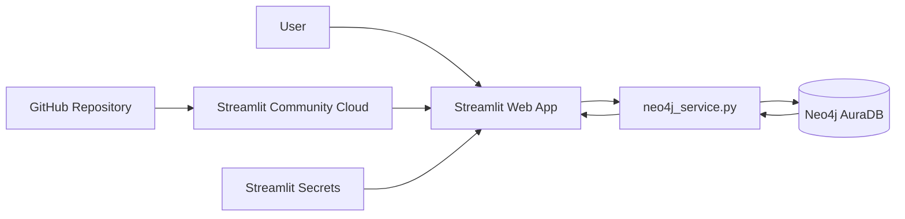
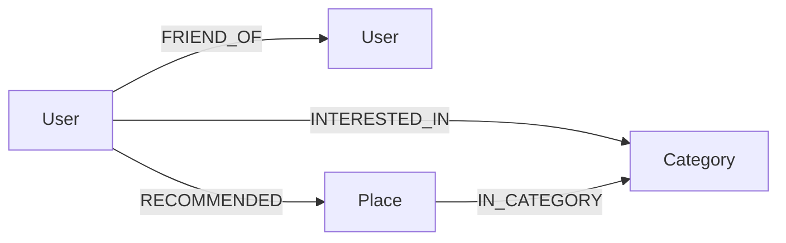

# คู่มือสร้างระบบแนะนำสถานที่ท่องเที่ยวด้วย Neo4j Aura + Streamlit

## 1) เป้าหมายการเรียนรู้

1. ออกแบบ Property Graph จากโจทย์ระบบจริง
2. อธิบาย Node, Label, Property, Relationship และ Direction
3. เขียน Cypher สำหรับ CRUD, traversal และ aggregation
4. เชื่อม Python กับ Neo4j Aura ด้วย official Neo4j Python Driver
5. สร้าง Explainable Recommendation จากความสัมพันธ์ในกราฟ
6. พัฒนา Web UI ด้วย Streamlit
7. แยก secret/credential ออกจาก source code
8. deploy ระบบจาก GitHub ไป Streamlit Community Cloud

---

## 2) สถาปัตยกรรมระบบ



- **Presentation layer:** `app.py`
- **Database access layer:** `neo4j_service.py`
- **Graph database:** Neo4j AuraDB
- **Deployment/configuration:** GitHub + Streamlit Community Cloud + Secrets

---

## 3) Graph Data Model



### Node

| Label | Primary property | property อื่น | หน้าที่ |
|---|---|---|---|
| User | user_id | name, avatar, bio, joined | ผู้ใช้/ผู้แนะนำ |
| Place | place_id | name, province, region, image, description, rating, best_time, created_at | สถานที่ท่องเที่ยว |
| Category | name | name | ประเภท (ทะเล/ภูเขา/วัด/น้ำตก/เมือง/คาเฟ่) |

### Relationship

| Relationship | Source → Target | Property | ความหมาย |
|---|---|---|---|
| FRIEND_OF | User → User | - | เพื่อน |
| RECOMMENDED | User → Place | recommended_date | ผู้ใช้แนะนำสถานที่ (one-to-many) |
| INTERESTED_IN | User → Category | - | ความสนใจ |
| IN_CATEGORY | Place → Category | - | ประเภทสถานที่ |

---

## 4) เหตุผลที่ Graph Database เหมาะกับโจทย์นี้

หา "สถานที่ที่เพื่อนแนะนำ แต่ผู้ใช้ยังไม่ได้แนะนำเอง" ใน RDBMS ต้อง JOIN หลายตาราง ใน Graph เขียนเป็น pattern ได้ตรงๆ

```cypher
MATCH (u:User {user_id:$user_id})-[:FRIEND_OF]-(friend:User)-[:RECOMMENDED]->(place:Place)
WHERE NOT (u)-[:RECOMMENDED]->(place)
RETURN place
```

---

## 5) Recommendation Algorithm

```text
social_score     = friend_count × 3
interest_score   = interest_matches × 2
popularity_score = popularity × 0.20      (จำนวนผู้ใช้ที่สนใจหมวดของสถานที่)
rating_score     = rating × 0.50          (Place.rating 1-5)
score = social + interest + popularity + rating
```

ตัดสถานที่ที่ผู้ใช้แนะนำเองออกด้วย `WHERE NOT (u)-[:RECOMMENDED]->(p)`
สูตรนี้ใช้เพื่อสอนแนวคิด ไม่ใช่สูตรที่ดีที่สุดเชิงวิจัย

---

## 6) Explainable Recommendation

ระบบคืน evidence ประกอบ เช่น เพื่อนกี่คนเคยแนะนำ (ชื่อใคร), ตรงหมวดความสนใจใด, หมวดมีผู้สนใจกี่คน, เรตติ้งเท่าไร

```text
เพื่อน 1 คนเคยแนะนำ (มาลี) • ตรงกับความสนใจ 1 หมวด (ทะเล) • หมวดนี้มีผู้สนใจ 4 คน • เรตติ้ง 4.7/5
```

---

## 7) Constraint และเหตุผลที่ต้องใช้ MERGE

```cypher
CREATE CONSTRAINT user_id_unique IF NOT EXISTS
FOR (u:User) REQUIRE u.user_id IS UNIQUE;
```

seed ด้วย `MERGE` เพื่อให้กดซ้ำได้โดยไม่เกิด node ซ้ำ

---

## 8) Parameterized Cypher

```python
cypher = "MATCH (u:User {user_id:$user_id}) RETURN u"
params = {"user_id": user_id}
```

---

## 9) การเชื่อมต่อ Neo4j Aura

`neo4j_service.py` สร้าง `Driver` เดียวและ cache ด้วย `@st.cache_resource` แล้วเรียก `driver.execute_query()` พร้อมระบุ database และ parameter

---

## 10) หน้าจอของระบบ

- **Dashboard:** จำนวน User/Place, เรตติ้งเฉลี่ย, จำนวน relationship, กราฟแท่งตามภาค, profile ผู้ใช้
- **Recommendations:** เลือกผู้ใช้, กำหนด Top-N, แสดง score และเหตุผล
- **Place Search:** ค้นชื่อ/จังหวัด, filter ภาค/ประเภท/เรตติ้ง, เรียงลำดับ, card grid 3 คอลัมน์
- **Manage Places:** เพิ่ม/แก้ไข/ลบสถานที่ (URL หรืออัปโหลดรูป)
- **Manage Users:** เพิ่ม/แก้ไข/ลบผู้ใช้ (เลือกลบหรือย้ายสถานที่)
- **Graph Explorer:** neighborhood graph ของผู้ใช้
- **Admin / Setup:** สร้าง constraint + demo data, Export CSV/JSON, Reset

---

## 11) Secrets

`.streamlit/secrets.toml`

```toml
[neo4j]
uri = "neo4j+s://YOUR_INSTANCE.databases.neo4j.io"
username = "neo4j"
password = "YOUR_PASSWORD"
database = "neo4j"
```

ห้าม commit ไฟล์นี้ (อยู่ใน `.gitignore` แล้ว)

---

## 12) GitHub

```bash
git init
git add .
git commit -m "Initial TravelGraph recommender"
git branch -M main
git remote add origin YOUR_GITHUB_REPOSITORY_URL
git push -u origin main
```

ตรวจด้วย `git status` ว่า `.streamlit/secrets.toml` ไม่ถูก stage

---

## 13) Deploy Streamlit Community Cloud

Create app → เลือก repo/branch `main` → main file `app.py` → Advanced settings → Secrets วาง `[neo4j] ...` → Deploy

---

## 14) ลำดับ Lab ที่แนะนำ

1. Graph Model 2. Seed Data (`UNWIND + MERGE`) 3. Basic Cypher 4. Traversal 5. Aggregation
6. Recommendation 7. Python Driver 8. Streamlit 9. Deployment 10. Evaluation / Extension

---

## 15) แนวทางต่อยอด

Login/Role, Favorite, รีวิวจากผู้ใช้อื่น, friend suggestion, user/place similarity, Graph Data Science, PageRank, Precision@K/Recall@K, เปรียบเทียบ Social-only / Content-only / Hybrid
